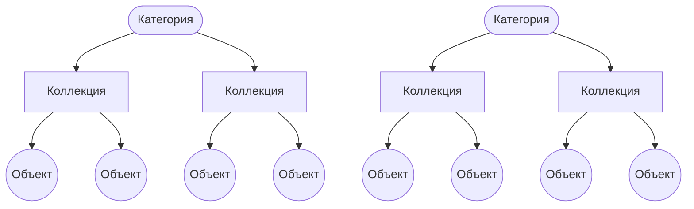

import { Callout } from 'nextra/components'

# Сущности

Здесь вы можете ознакомиться со всеми сущностями, представлеными в API.

На данный момент есть 4 условные категории сущностей:

    1. [Объединяющие](#категории-и-коллекции) (Категории и Коллекции);
    2. [Основные объекты](#основные-объекты) (Артефакты, Книги, Фотографии ООПТ и т.д.)
    3. [Дополнительные](#дополнительные) (Культуры, Локации, Жанры книг и т.д.)
    4. [Неиспользуемые](#неиспользуемые)

Взаимосвязь Категорий, Коллекций и Объектов отражается следующим образом:


## Категории и Коллекции

В API представлены как:
    - `categories` - **Категории** (Археологичекие коллекции, Этнографические коллекции, ...)
    - `collections` - **Коллекции** (Археология, Русская традиционная культура, ...)

Пример Query для получения Коллекций:
```graphql showLineNumbers
query GetArtifactsCollections($where: CollectionWhereInput) {
  collections(where: $where) {
    totalCount
    edges {
      node {
        id
        slug
        displayName
        description
        type
        category {
          id
          slug
          displayName
        }
      }
    }
  }
}
```
Variables для Arguments ($where):
```json showLineNumbers
{
  "where": {
    "type": "artifacts"
  }
}
```
<Callout type="info" emoji="ℹ️">
  Как работать с параметрами - Arguments (в примере `$where`) описывается в разделе [Параметры](/arguments).
</Callout>

Response:
```json showLineNumbers
{
  "data": {
    "collections": {
      "totalCount": 3,
      "edges": [
        {
          "node": {
            "id": "34359738370",
            "slug": "archaeology",
            "displayName": "Археология",
            "description": "",
            "type": "artifacts",
            "category": {
              "id": "30064771074",
              "slug": "archaeological-collections",
              "displayName": "Археологические коллекции"
            }
          }
        },
        {
          "node": {
            "id": "34359738384",
            "slug": "ethnography",
            "displayName": "Этнография народов Сибири",
            "description": "",
            "type": "artifacts",
            "category": {
              "id": "30064771116",
              "slug": "ethnographic-collections",
              "displayName": "Этнографические коллекции"
            }
          }
        },
        {
          "node": {
            "id": "34359738386",
            "slug": "russian-traditional-culture",
            "displayName": "Русская традиционная культура",
            "description": "",
            "type": "artifacts",
            "category": {
              "id": "30064771116",
              "slug": "ethnographic-collections",
              "displayName": "Этнографические коллекции"
            }
          }
        }
      ]
    }
  }
}
```

## Основные объекты

В API представлены как:
  - `artifacts` - **Артефакты**
  - `petroglyphs` - **Петроглифы**
  - `arts` - **Изобразительно искусство**
  - `books` - **Книги**
  - `dendrochronologies` - **Дендрохронология**
  - `herbaria` - **Гербарий**
  - `protectedAreaPictures` - **Фотографии ООПТ**

Пример Query для получения Артефактов:
```graphql showLineNumbers
query GetAllArtifacts {
  artifacts {
    totalCount
    edges {
      node {
        id
        displayName
        goskatalogNumber
        dimensions
      }
    }
  }
}
```

Response:
```json showLineNumbers
{
  "data": {
    "artifacts": {
      "totalCount": 1616,
      "edges": [
        {
          "node": {
            "id": "12884901888",
            "displayName": "Наконечник стрелы",
            "goskatalogNumber": "МСФУ ОФ-17/1",
            "dimensions": "5.4x1.7x0.1 мм"
          }
        },
        {
          "node": {
            "id": "12884901889",
            "displayName": "Сосуд",
            "goskatalogNumber": "МСФУ ОФ-17/10",
            "dimensions": "Высота: 14 мм;\nДиаметр: 11 мм;"
          }
        },
        {
          "node": {
            "id": "12884901890",
            "displayName": "Заготовка рубящего орудия",
            "goskatalogNumber": "МСФУ ОФ-17/11",
            "dimensions": "11.1x5.6x3.7 мм"
          }
        },
        ...
      ]
    }
  }
}
```

## Дополнительные

Связанны с определенной основной сущностью. Например **Жанры** связанны только с **Книгами**.
<Callout type="warning" emoji="⚠️">
  Могут встречаться исключения, например **Петроглифы** имеют схожие связи с **Артефактами**.
  Также имеются общие сущности для всех, такие как **Лицензии**.
</Callout>

  ### Артефакты
    - `cultures` - **Культуры**
    - `ethnosSlice` - **Этнос**
    - `media` - **Материалы**
    - `techniques` - **Техники**
    - `sets` - **Комплекс Памятников**
    - `monuments` - **Памятники**
    - `projects` - **Проекты**
    - `publications` - **Публикации**
    - `models` - **3D-модели**

  ### Петроглифы
    - `cultures` - **Культуры**
    - `techniques` - **Техники**
    - `mounds` - **Курганы**
    - `publications` - **Публикации**
    - `models` - **3D-модели**

  ### Изобр. искусство
    - `artGenres` - **Жанры**
    - `artStyles` - **Стиль**
    - `techniques` - **Техники**

  ### Книги
    - `bookGenres` - **Разделы/Жанры**
    - `periodicals` - **Издания/Журналы**
    - `publishers` - **Издатели**

  ### Дендрохронология
    - `dendrochronologicalAnalyses` - **Анализ Дендрохронологии**

  ### Гербарий
    - `familiaSlice` - **Семейства**
    - `genusSlice` - **Род**
    - `groups` - **Отдел**
    - `speciesSlice` - **Виды**

  ### Фотографии ООПТ
    - `protectedAreaCategories` - **Категории Особо охраняемых природных территорий (Категории ООПТ)**
    - `protectedAreas` - **Особо охраняемые природные территории (ООПТ)**

  ### Общие
    - `countries` - **Страны**
    - `regions` - **Регионы**
    - `districts` - **Районы**
    - `settlements` - **Населенные пункты**
    - `locations` - **Локации**
    - `licenses` - **Лицензии**
    - `organizations` - **Организации**
    - `persons` - **Личности**

## Неиспользуемые

На данный момент никак не используются на платформе:
  - `auditLogs`
  - `favourites`
  - `interviews`
  - `visits`
  - `personalCollections`

Вы можете **проигнорировать** их.

## Node

Так же имеется сущность `node` / `nodes` позволяющая получить по `id` любую сущность любого вида.

Пример Query:
```graphql showLineNumbers
query GetAnyObjectById($nodeId: ID!) {
  node(id: $nodeId) {
    ... on Artifact {
      id
      displayName
    }
    ... on Art {
      id
      displayName
    }
    ... on Book {
      id
      displayName
    }
  }
}
```
Variables для Arguments ($nodeId):
```json showLineNumbers
{
  "nodeId": "12884903657"
}
```
<Callout type="info" emoji="ℹ️">
  Как работать с параметрами - Arguments (в примере `$nodeId`) описывается в разделе [Параметры](/arguments).
</Callout>

Response:
```json showLineNumbers
{
  "data": {
    "node": {
      "id": "12884903657",
      "displayName": "Железный наконечник стрелы"
    }
  }
}
```